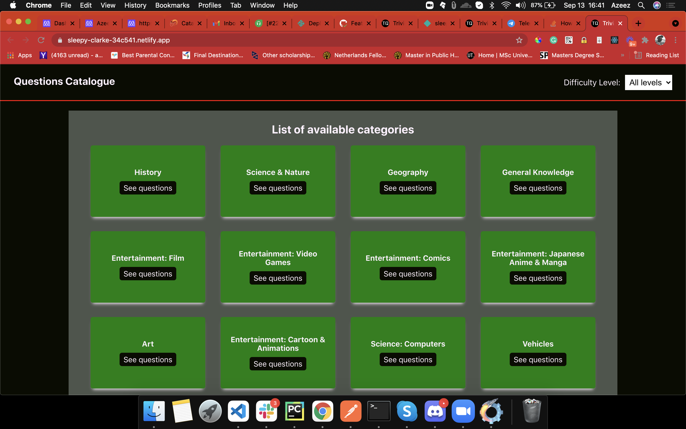
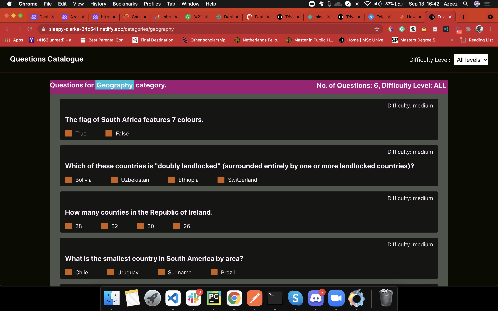

# Catalogue-of-Questions

> A single page application that fetches data from [Open Trivia API](https://opentdb.com/) into Redux store. Visitors can see all available categories and also filter the trivia questions based on the selected difficulty. Built with React, Redux &amp; React Hooks. This project is one of the **Catalogue of Statistics** project: a React/Redux capstone project in microverse curriculum.

## Built With

- CSS Modules
- npm & ES6
- React/Redux
- React Hooks
- React-Create-App
- React Testing Library
- 

## Live Demo

[Catalogue of Trivia Questions](https://sleepy-clarke-34c541.netlify.app/)

## Project presentation links (9minutes)

[Part 1](https://www.loom.com/share/183c16c91e2240939a7c6b2374ebb2f2)
[Part 2](https://www.loom.com/share/d3ad7b61c4744a69acb40ff4ab1bd7ae)

## Getting Started

To get a local copy up and running follow these simple example steps.

- On the project GitHub page, navigate to the main page of the repository [this page](https://github.com/teekaytech/Catalogue-of-Trivia-Questions).
- Under the repository name, locate and click on a green button named `Code`.
- Copy the project URL as displayed.
- If you're running Windows Operating System, open your command prompt. On Linux, Open your terminal.
- Change the current working directory to the location where you want the cloned directory to be made. Leave as it is if the current location is where you want the project to be.
- Type `git clone`, and then paste the URL you copied in Step 3. 
  `$ git clone https://github.com/teekaytech/Catalogue-of-Trivia-Questions.git` <em>Press Enter key</em> 
- Press Enter. Your local copy will be created.

Please Note that you must have github installed on your PC, this can be done

### Making Changes / Running the app locally

- `npm install` to install the dependencies and packages
- `npm start` to test the app before or after changes were made

### Prerequisites

- [Git](https://gist.github.com/derhuerst/1b15ff4652a867391f03).
- Web browser (Chrome/Firefox)
- [Node](https://nodejs.org/en/)
- [NPM](https://www.npmjs.com/get-npm)

### Usage

Click on the live demo link and peruse the app.

## Author

built to mark th
👤 **Azeez Ibrahim**

- Github: [@kunmi02](https://github.com/kunmi02)
- Twitter: [@akinkunmi006](https://twitter.com/akinkunmmi006)
- Linkedin: [Azeez Ibrahim](https://linkedin.com/in/azeezakinkunmi)
- Portfolio: [Azeez Ibrahim](https://akinkunmi.me/)

## 🤝 Contributing

Contributions, issues and feature requests are welcome!

## Show your support

Give a ⭐️ if you like this project!

## Acknowledgments

- [Microverse](https://.microverse.org/)
- [create-react-app boilerplate from Facebook team](https://github.com/facebook/create-react-app)
- [Netlify](https://app.netlify.com/)
- [Design idea by Nelson Sakwa on Behance](<https://www.behance.net/gallery/31579789/Ballhead-App-(Free-PSDs)>)
- [React Hooks](https://reactjs.org/docs/hooks-intro.html)
- [CSS Modules](https://css-tricks.com/css-modules-part-1-need/)
- [React Testing Library](https://github.com/testing-library/react-testing-library)

## 📝 License

This project is [MIT](/LICENSE) licensed.
